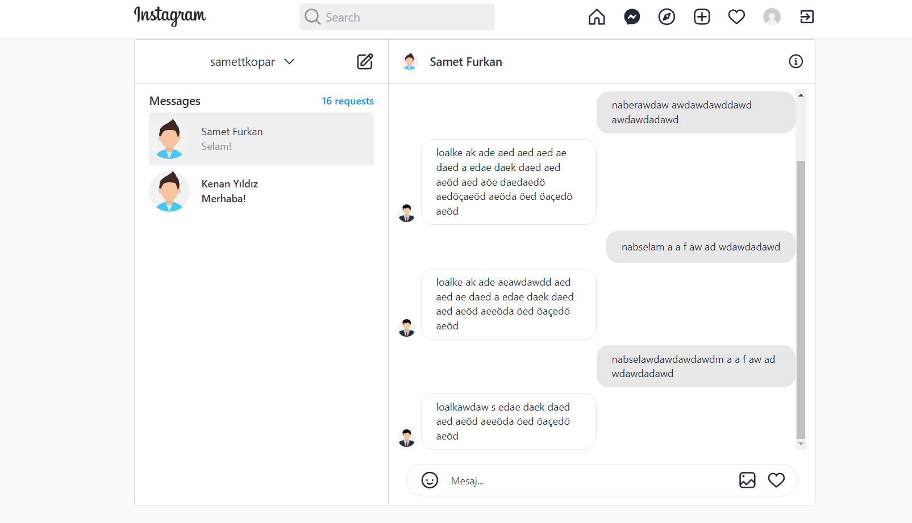
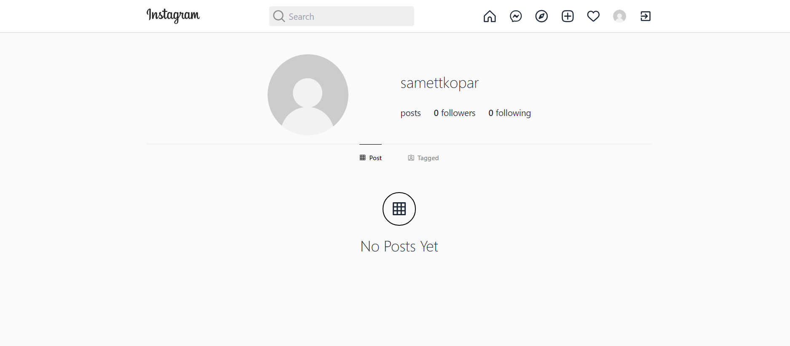
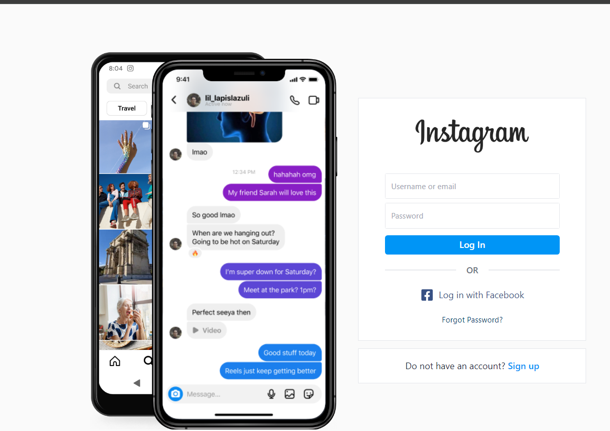

# Social-Media Project

This project is a social media application developed using various technologies including React, Vite, Tailwind CSS, Redux Toolkit, and Firebase.

## Technologies Used:
- React
- Vite
- Tailwind CSS
- Redux Toolkit
- Firebase

## Getting Started:
To get started with the project, follow these steps:
1. Install project dependencies by running:npm i
2. Start the project by running:npm run dev

## Screenshots:
Below are screenshots of different screens within the project:

